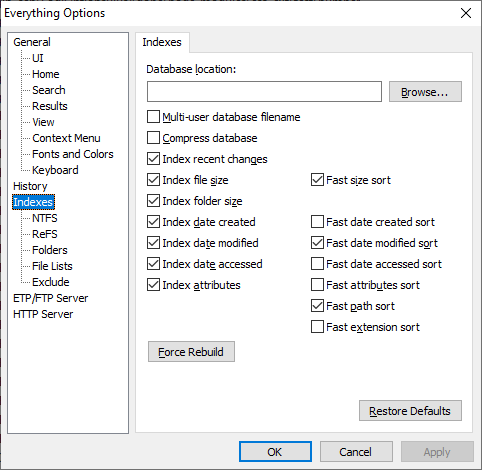

> Language: **English** · [Русский](README.ru.md)

# es-search

A [Claude Code](https://docs.claude.com/en/docs/claude-code) skill that turns
[Everything](https://www.voidtools.com/) into Claude's default file-search
tool on Windows. With this skill installed, Claude reaches for `es.exe`
instead of `Get-ChildItem -Recurse` or the `Glob` tool whenever it needs to
locate files by name, extension, size, date, attributes, or duplicates.

## Why

`Get-ChildItem -Recurse` and the built-in `Glob` tool walk the filesystem
every time. On large drives that takes seconds to minutes. **Everything**
indexes the NTFS MFT and answers in milliseconds regardless of how many
files you have. This skill teaches Claude the full Everything search syntax
plus the CLI quirks needed to use it correctly from PowerShell.

## Requirements

- Windows 10 or later
- [Everything](https://www.voidtools.com/downloads/) running with its
  indexing service
- [Everything Command-line Interface (`es.exe`)](https://github.com/voidtools/ES/releases)
  on `PATH` — **version 1.1.0.37 or later** (earlier builds have no JSON
  output and use the removed `-o` / `-offset` pagination)
- [Claude Code](https://docs.claude.com/en/docs/claude-code) installed

Get `es.exe` from the [voidtools/ES GitHub releases](https://github.com/voidtools/ES/releases)
(pick the `x64` zip on 64-bit Windows) and extract it onto your `PATH` — e.g.
`%LOCALAPPDATA%\Microsoft\WindowsApps`.

Verify the CLI is reachable:

```powershell
es -version
```

You should see `1.1.0.37` (or newer) and exit code 0.

> **Tip.** The more indexing options you enable in Everything
> (**Tools → Options... → Indexes**), the more search capabilities
> become available to this skill — broader index scope and more
> filters answering instantly.
>
> 

## Installation

Drop the `SKILL.md` file into Claude's skills directory:

```
%USERPROFILE%\.claude\skills\es-search\SKILL.md
```

Claude Code auto-discovers skills under `~/.claude/skills/`. Restart your
session if it was already running.

## What it covers

The skill documents and gives idiomatic PowerShell examples for:

- Name / wildcard / regex / extension filters
- Boolean operators (AND / OR / NOT / grouping) with the **critical**
  argv-tokenization rule (the single biggest pitfall when calling `es.exe`
  from PowerShell)
- Path scoping (`-path`, `-parent`, `path:`, `-p`) — including the
  bare-drive-letter pitfall: `-path D:` means that drive's **current
  directory**, not the drive (`-path "D:\"` does), and it under-reports
  silently
- Size, date (modified / created / accessed), and attribute filters
- Duplicate discovery (`dupe:`, `sizedupe:`, `dmdupe:`, `attribdupe:`)
- Sorting, viewport pagination, aggregates (`-get-result-count`,
  `-get-total-size`, `-get-folder-size`)
- Output formats (JSON / CSV / TSV / EFU / TXT / M3U8) with column-behavior
  notes — JSON is the preferred format for parsing via `ConvertFrom-Json`
- Match modifiers: case (`-i`), whole-word (`-w`), diacritics (`-a`),
  prefix / suffix, ignore punctuation / whitespace
- Case-sensitivity gotcha (`-i` means **match-case**, the opposite of
  POSIX `grep -i`)
- `empty:` vs `size:0` distinction (empty **folders** vs zero-byte **files**)
- Media-metadata caveats (audio tags work only when indexed; image
  dimensions / file properties require additional configuration)
- Exit-code interpretation and graceful fallback to `Glob` /
  `Get-ChildItem` when Everything is unavailable

Every rule and example in [`SKILL.md`](SKILL.md) has been empirically
verified against `es.exe 1.1.0.37` / Everything 1.4.1.1024.

## What it does NOT do

- Content search inside files (use Claude's `Grep` tool — Everything's
  `content:` syntax exists but bypasses the index and is slow)
- Cross-platform search (`es.exe` is Windows-only; `Glob` is the fallback
  on macOS / Linux)
- Anything Everything isn't indexing (network shares not added to its
  index, removable media, etc.)

## See also

- The full skill specification: [`SKILL.md`](SKILL.md)
- `es.exe` source & releases: <https://github.com/voidtools/ES>
- Everything search syntax: <https://www.voidtools.com/support/everything/searching/>
- Everything CLI reference: <https://www.voidtools.com/support/everything/command_line_interface/>
- Claude Code skills documentation: <https://docs.claude.com/en/docs/claude-code/skills>

## License

[MIT](LICENSE)
