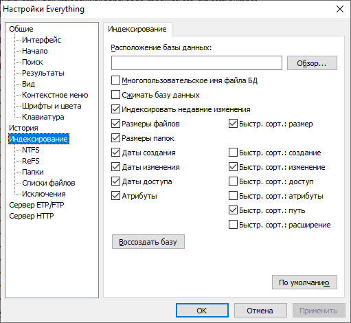

> Язык: [English](README.md) · **Русский**

# es-search

Скилл для [Claude Code](https://docs.claude.com/en/docs/claude-code),
делающий [Everything](https://www.voidtools.com/) основным средством
поиска файлов Claude'а на Windows. С установленным скиллом Claude
использует `es.exe` вместо `Get-ChildItem -Recurse` или встроенного
инструмента `Glob`, когда ему нужно найти файлы по имени, расширению,
размеру, дате, атрибутам или дубликатам.

## Зачем

`Get-ChildItem -Recurse` и встроенный `Glob` каждый раз обходят
файловую систему — на больших дисках это занимает от секунд до минут.
**Everything** индексирует NTFS MFT и отвечает за миллисекунды
независимо от количества файлов. Этот скилл обучает Claude полному
синтаксису Everything search syntax и тонкостям CLI, нужным для
корректного вызова из PowerShell.

## Требования

- Windows 10 или новее
- [Everything](https://www.voidtools.com/downloads/) с запущенной
  службой индексирования
- [Everything Command-line Interface (`es.exe`)](https://github.com/voidtools/ES/releases)
  в `PATH` — **версия 1.1.0.37 или новее** (в более ранних сборках нет
  JSON-вывода и используется удалённая пагинация `-o` / `-offset`)
- Установленный [Claude Code](https://docs.claude.com/en/docs/claude-code)

Скачайте `es.exe` со [страницы релизов voidtools/ES на GitHub](https://github.com/voidtools/ES/releases)
(на 64-битной Windows берите zip с `x64`) и распакуйте в каталог из `PATH` —
например `%LOCALAPPDATA%\Microsoft\WindowsApps`.

Проверка доступности CLI:

```powershell
es -version
```

Ожидаемый вывод — `1.1.0.37` (или новее) и exit code 0.

> **Совет.** Чем больше опций индексирования включено в Everything
> (**Сервис → Настройки... → Индексирование**), тем больше
> возможностей поиска становится доступно для этого скилла — шире
> охват индекса и больше фильтров, отвечающих мгновенно.
>
> 

## Установка

Скопируйте файл `SKILL.md` в каталог скиллов Claude'а:

```
%USERPROFILE%\.claude\skills\es-search\SKILL.md
```

Claude Code автоматически подхватывает скиллы из `~/.claude/skills/`.
Если сессия уже была запущена — перезапустите её.

## Что покрывает

Скилл документирует и даёт идиоматичные PowerShell-примеры для:

- Фильтров по имени / wildcard / regex / расширению
- Boolean-операторов (AND / OR / NOT / группировка) с **критичным**
  правилом argv-токенизации (главная ловушка при вызове `es.exe` из
  PowerShell)
- Ограничения по пути (`-path`, `-parent`, `path:`, `-p`)
- Фильтров по размеру, дате (изменения / создания / доступа) и
  атрибутам
- Поиска дубликатов (`dupe:`, `sizedupe:`, `dmdupe:`, `attribdupe:`)
- Сортировки, viewport-пагинации, агрегатов (`-get-result-count`,
  `-get-total-size`, `-get-folder-size`)
- Форматов вывода (JSON / CSV / TSV / EFU / TXT / M3U8) с особенностями
  колонок — JSON предпочтителен для парсинга через `ConvertFrom-Json`
- Модификаторов поиска: регистр (`-i`), целые слова (`-w`), диакритика
  (`-a`), prefix / suffix, игнор пунктуации / пробелов
- Подвоха с регистром (`-i` означает **match-case**, то есть
  противоположно POSIX-овскому `grep -i`)
- Различия `empty:` и `size:0` (пустые **папки** vs zero-byte **файлы**)
- Особенностей media-метаданных (audio tags работают только при
  включённой индексации; размеры изображений / file properties
  требуют дополнительной настройки)
- Интерпретации exit-кодов и аккуратного fallback'а на `Glob` /
  `Get-ChildItem`, когда Everything недоступен

Каждое правило и пример в [`SKILL.md`](SKILL.md) эмпирически проверены
против `es.exe 1.1.0.37` / Everything 1.4.1.1024.

## Что НЕ умеет

- Поиск по содержимому файлов (используйте `Grep` от Claude'а — в
  Everything есть синтаксис `content:`, но он обходит индекс и
  медленный)
- Кросс-платформенный поиск (`es.exe` существует только для Windows;
  на macOS / Linux fallback — `Glob`)
- Что-либо, не попадающее в индекс Everything (сетевые шары, не
  добавленные в индекс, съёмные носители и т.д.)

## Смотрите также

- Полная спецификация скилла: [`SKILL.md`](SKILL.md)
- Исходники и релизы `es.exe`: <https://github.com/voidtools/ES>
- Everything search syntax: <https://www.voidtools.com/support/everything/searching/>
- Everything CLI reference: <https://www.voidtools.com/support/everything/command_line_interface/>
- Документация Claude Code по скиллам: <https://docs.claude.com/en/docs/claude-code/skills>

## Лицензия

[MIT](LICENSE)
